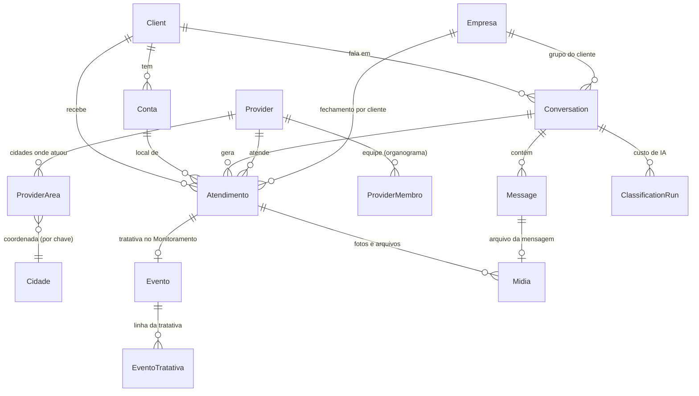

# Banco de dados — documentação completa

> Atualizado em 2026-09-15. Fonte da verdade: `apps/api/prisma/schema.prisma`. **Toda mudança no schema deve atualizar este documento** junto.

- **Motor:** PostgreSQL 16 (Docker, container `projetowhatsapppr7-postgres-1`, volume `projetowhatsapppr7_postgres_data`).
- **Acesso:** somente `127.0.0.1:5432` (não fica exposto na rede local). Usuário/banco: `atendimento`.
- **ORM e migrações:** Prisma 5.22. Histórico em `apps/api/prisma/migrations/` (19 migrações até agora).
- **Arquivos (fotos, vídeos, áudios, documentos):** fora do banco, em `storage/midias/AAAA/MM/<id>.<ext>` (no `.gitignore`); o banco guarda só o registro em `Midia`.
- **Backup:** `scripts/backup-banco.ps1` → `backups/atendimento-AAAA-MM-DD_HHMM.sql` (guarda os 14 mais recentes). Ver [Backup e restauração](#backup-e-restauração).
- **Dados pessoais:** tabelas marcadas com 🔒 contêm dados pessoais (nomes, telefones, e-mails). Nunca exportar, versionar ou colar em documentação/chat.

## Mapa das tabelas



`AdminUser`, `EventoSeguranca` e `Restrito` são independentes (acesso, auditoria, bloqueio). `Cidade` liga-se por chave normalizada (`nome|UF`), sem chave estrangeira.

| Tabela | Para quê | Registros (15/09) | Origem dos dados |
|---|---|---|---|
| `Empresa` | **Empresa cliente contratante** (Orsegups, Segurpro, Belfort...) — base do fechamento | 40 | Planilha Clientes.xlsx |
| `Client` 🔒 | Cliente/estabelecimento atendido (legado: também grupos) | ~1.980 | Planilha, WhatsApp, cadastro manual |
| `Conta` | Local monitorado de um cliente (loja, posto, agência) | ~4.060 | Planilha, cadastro manual |
| `Atendimento` | Cada ocorrência/chamado — o coração do sistema | ~15.650 | Planilha, WhatsApp (IA + formulário de retorno), formulário do painel |
| `Evento` | Evento na fila do **Monitoramento** (tratativa da central) | cresce | WhatsApp (grupo de cliente), registro manual |
| `EventoTratativa` | Linha do tempo da tratativa de cada evento | cresce | Operador, IA, sistema |
| `Conversation` | Conversa ou grupo de WhatsApp (tipo cliente/prestador/interno) | 25 | Webhook do WhatsApp |
| `Message` 🔒 | Mensagens das conversas | ~410 | Webhook do WhatsApp |
| `Midia` 🔒 | Fotos/vídeos/áudios/documentos recebidos (arquivo em `storage/midias`) | ~110 | Webhook do WhatsApp |
| `Provider` 🔒 | Prestador acionado (individual ou adm de equipe) | 1.170 | Planilha, organograma |
| `ProviderMembro` 🔒 | Agentes da equipe de um prestador | ~2.540 | Planilha, organograma |
| `ProviderArea` | Cidades onde cada prestador já atendeu | ~2.250 | Derivada dos atendimentos |
| `Restrito` 🔒 | Lista de bloqueio (quem não pode atender) | 1 | E-mails da operação, painel |
| `Cidade` | Coordenada de cada cidade (mapa) | ~800 | OpenStreetMap/Nominatim |
| `ClassificationRun` | Custo de cada chamada à IA | cresce | Classificação por IA |
| `AdminUser` 🔒 | Usuários do painel (admin/operadores) | 2 | Tela Usuários |
| `EventoSeguranca` | Trilha de auditoria | cresce sempre | Automático |

---

## Empresa (cliente contratante)
Quem contrata o PR7 e recebe o fechamento. Importada de `Clientes.xlsx` por `apps/api/scripts/importar-clientes.ts` (atualiza pelo CNPJ; pode rodar de novo).

| Campo | Regra |
|---|---|
| `razaoSocial`, `nomeFantasia` | Nome oficial e nome de mercado |
| `cnpj` | Só dígitos, único. Filiais (ex: Segurpro por cidade) têm CNPJ próprio |
| `inscMunicipal`, `inscEstadual`, `email`, `telefone`, `endereco`, `bairro`, `cidade`, `uf`, `cep` | Cadastro; "—" na planilha vira vazio |
| `ativo`, `situacao`, `qtdOrdensServico`, `cadastradoEm` | Do sistema anterior |
| `apelidos` | Palavras que identificam a empresa em nome de grupo (`orsegups`, `belfort`, `segurpro`...). Gerados na importação |

**Grupo → empresa** (`src/empresas/empresa-grupo.ts`): o nome do grupo precisa conter um apelido ("PR7 & ORSEGUPS" → Orsegups). Empresa com filiais: prefere a filial cuja cidade aparece no nome do grupo; senão, a matriz. Grupo de prestador/interno nunca recebe empresa.

## Client 🔒
Cliente/estabelecimento atendido. Hoje também guarda o "cliente provisório" de cada grupo de WhatsApp (nome do grupo) — **a empresa contratante é a tabela `Empresa`**.

| Campo | Tipo | Regra / significado |
|---|---|---|
| `id` | uuid | Chave |
| `name` | texto | Nome do cliente |
| `phone` | texto, único | Telefone quando veio do WhatsApp. **Importados/manuais usam `import:<nome>`** como chave técnica (não é telefone) |
| `createdAt` / `updatedAt` | data | Controle |

## Conta
Vínculo cliente ↔ endereço monitorado. **Endereço travado**: nunca editar o endereço de uma conta existente (já causou despacho para o lugar errado no sistema antigo); mudança real de endereço = conta nova.

| Campo | Tipo | Regra / significado |
|---|---|---|
| `codigo` | texto, único | Código da conta no cliente (ex: `2AC1C`). Sem código: `estabelecimento\|cidade\|UF` |
| `clientId` | → Client | Dono da conta |
| `estabelecimento` | texto | Nome do local |
| `endereco`, `cidade`, `estado` | texto | Local. `estado` = UF de 2 letras |
| `enderecoTravado` | booleano | Sempre `true` (proteção descrita acima) |

## Atendimento
Cada ocorrência. Pode nascer de 3 formas: **planilha** (sem conversa), **WhatsApp** (com `conversationId`, classificado pela IA) ou **formulário "Nova ocorrência"** (`detalhes.registradoPor`).

| Campo | Tipo | Regra / significado |
|---|---|---|
| `vertical` | enum `PATRIMONIAL` \| `VEICULAR` | Linha de negócio. Define campos e fluxo. Operadores só veem as verticais liberadas |
| `clientId` | → Client | Obrigatório |
| `contaId` | → Conta, opcional | Patrimonial. Veicular não tem conta |
| `conversationId` | → Conversation, opcional | Só quando veio do WhatsApp. A reimportação da planilha recria apenas os atendimentos da planilha |
| `ocorrencia` | texto | Nº da ocorrência/conta no sistema do cliente. Separa chamados diferentes no mesmo grupo |
| `idPR7` | texto | **ID do acionamento gerado pelo PR7** (formulário "ID: 36877"; planilha: coluna "Id"). Chave única que liga o pedido do cliente, o repasse e o retorno do prestador |
| `codigoValidacao`, `sap` | texto | Chaves de conferência de alguns clientes (planilha: "Validação" e "Sap"; formulário: "Código de validação", "SAP") |
| `empresaId` | → Empresa | Empresa contratante (vem do grupo do cliente) |
| `responsavelLocalNome`, `responsavelLocalTelefone` 🔒 | texto | Responsável no local ("Contato no local" do retorno, ou nome no relato + telefone informado na conversa). Telefone só dígitos com DDD |
| `category` | texto | Tipo de serviço: Ronda, Preservação, Rondas Periódicas, Manutenção Patrimonial, Vistoria, Recuperação de Veículo... |
| `summary` | texto | Motivo / relato |
| `resultado` | texto | Desfecho |
| `status` | enum `NOVO` \| `EM_ANDAMENTO` \| `CONCLUIDO` \| `CANCELADO` \| `NAO_ATENDIDO` | CANCELADO = cliente cancelou; NAO_ATENDIDO = PR7 não conseguiu atender. Planilha: CONCLUIDO se tem "Data Termino"; linhas "Desconsiderar"/canceladas viram não atendimento |
| `providerId` | → Provider | Quem foi acionado. **Não pode ser prestador RESTRITO** (API recusa) |
| `agenteNome` | texto | Quem foi ao local. **Não pode ser agente RESTRITO** |
| `operadorPR7` | texto | Operador PR7 responsável (no formulário: nome do usuário logado) |
| `valorPrestador` | decimal(12,2) | 💰 Valor pago ao prestador. Planilha: coluna "Valor" |
| `valorTotalPrestador` | decimal(12,2) | 💰 Total ao prestador com adicionais. Planilha: "Valor Total" |
| `valorCliente` | decimal(12,2) | 💰 Cobrado do cliente. Planilha: "Preservação cliente" |
| `formaPagamento` | texto | Semanal, Quinzenal, 48 Hrs... |
| `placa` | texto | Veicular, 7 caracteres sem traço (`ABC1D23`) |
| `latitude` / `longitude` | número | Veicular: coordenada da ocorrência |
| `detalhes` | JSON | Campos específicos da vertical (tabela abaixo) |
| `createdAt` | data | Data da solicitação (planilha) ou do registro |
| `solicitadoEm` | data/hora | Pedido do cliente. Planilha: "Data Solicitada" (hora 00:00 = sem hora → vazio). Formulário: momento do registro. WhatsApp: 1ª mensagem |
| `autorizacaoPedidaEm` | data/hora | Operador pediu autorização ao cliente ("apoio a 20 min, pode seguir?") |
| `liberadoEm` | data/hora | Cliente autorizou o deslocamento ("pode ir") |
| `acionadoEm` | data/hora | Prestador acionado — **tempo do operador**. Só existe em chamados do sistema (formulário, botão "marcar agora", IA, repasse no grupo de prestador). **A planilha não tem essa informação** |
| `chegadaEm` | data/hora | Prestador no local. Planilha: "Data Local" |
| `concluidoEm` | data/hora | Término. Planilha: "Data Termino" |
| `motivoNaoAtendimento` | enum | Obrigatório em `CANCELADO`/`NAO_ATENDIDO`: `CANCELADO_CLIENTE`, `NEGATIVA_PRESTADOR`, `DEMORA_ATENDIMENTO`, `SEM_PRESTADOR_REGIAO`, `FALSO_ALARME`, `DUPLICADO`, `OUTRO` |
| `detalheNaoAtendimento` | texto | Explicação livre |
| `recusadoPorId` | → Provider | Em negativa: quem recusou (separado de `providerId`, que é quem atendeu) |
| `encerradoPor`, `encerradoEm` | texto, data | Usuário (e-mail), `IA`, `planilha`, `retorno incompleto` ou `cliente liberou (IA)` |

**Datas/horas:** chamados do WhatsApp e do formulário de retorno guardam o **instante real (UTC)**; horários digitados em Brasília (`13:22`) são convertidos (+3 h). Os importados da planilha guardam a hora como veio.

### Regras de status automáticas (WhatsApp)
| Situação | Resultado |
|---|---|
| `CLASSIFICACAO_REVISAO_MANUAL=true` (padrão desde 15/09) | IA nunca encerra: fica `EM_ANDAMENTO`, sugestão em `detalhes.statusSugeridoIA` |
| Cliente responde "liberado" **depois** do retorno | `CONCLUIDO` (vale mesmo com revisão manual) e evento encerrado como Atendimento realizado |
| Formulário de retorno com obrigatório faltando (ID, Conta, Estabelecimento, Agente, Hr. chegada, Relato) | `NAO_ATENDIDO` sem motivo + `detalhes.pendenteMotivo` → **pop-up obrigatório** no painel |
| Formulário sem "Contato no local" | Só pendência (`detalhes.pendenciasRetorno`), não muda status |
| Mensagem só com "ID: …" (repasse ao grupo de prestadores) | Não é retorno: registra acionamento e tratativa, nunca muda status |

### Edição pelo painel (linha expandida)
`PATCH /atendimentos/:id` (permissão `atendimentos_criar`) grava só os campos enviados, registra na tratativa do evento quem mudou o quê e:
- status final sem motivo → erro (`Informe o motivo do não atendimento`);
- `CANCELADO` sem detalhe → grava "Cliente cancelou X min após a solicitação";
- reabrir (voltar para `NOVO`/`EM_ANDAMENTO`) limpa motivo, detalhe e encerramento, e reabre o evento;
- a IA **nunca** reescreve um chamado já encerrado (`CONCLUIDO`, `CANCELADO`, `NAO_ATENDIDO`), e um retorno incompleto não derruba chamado encerrado pela central. Só a **correção completa** de um retorno que tinha sido marcado "não atendido por retorno incompleto" reabre o chamado.

### Como o retorno encontra o chamado certo
1. **ID PR7** igual → vínculo direto (único).
2. Sem ID: **conta** entre abertos dos últimos 30 dias **e** mesma empresa **e** horário da solicitação a até 3 h **e** validação/SAP iguais quando existirem. Só liga se sobrar **exatamente 1**; 2 ou mais → não liga (log), para não errar.
3. **Conta cadastrada** (`contaId`) só é usada se o nome do estabelecimento também conferir — o mesmo nº de conta existe em empresas diferentes.
4. Não encontrou e o retorno está completo → cadastra o chamado a partir do formulário.

💰 **Valores só saem da API para usuários com a permissão `valores`** (removidos no servidor, não só escondidos na tela). Em prestador **EQUIPE**, o valor é o que o PR7 paga ao adm — o repasse aos agentes é acertado pela própria equipe e não é controlado aqui.

### Conteúdo de `Atendimento.detalhes` (JSON)

| Chave | Vertical | Conteúdo |
|---|---|---|
| `cidade`, `estado` | ambas | Local da ocorrência (Veicular não tem Conta; BI e mapa usam isto) |
| `canal` | ambas | WHATSAPP, TELEFONE, SISTEMA_CLIENTE, EMAIL, OUTRO |
| `registradoPor` | ambas | E-mail do usuário que registrou pelo formulário |
| `observacaoInterna` 🔒 | ambas | **Interno — nunca vai para relatório de cliente** |
| `checklist.{fiacao, quadroEletrico, portas, energizado, sirene, violado}` | Patrimonial | `SIM` / `NAO` |
| `horarios.{horaSolicitada, horaLocal, horaSaida, contatoLocal, insumos}` | Patrimonial | Horários e contato no local (contato é interno) |
| `veiculo.{modelo, marca, cor, renavam, equipamento, dadosAdicionais}` | Veicular | Dados do veículo |
| `carreta.{placa, marca, modelo, cor, renavam, dadosAdicionais}` | Veicular | Carreta, quando houver |
| `linhaDoTempo.{evento, deslocamento, transmissao, local, inicio, fim}` | Veicular | Datas/horas |
| `deslocamento.{kmInicial, kmFinal, kmTotal, franquiaHora, franquiaKm, totalHoras}` | Veicular | KM e franquia (totais calculados no formulário) |
| `relato.{descricaoFatos, gastosAdicionais}` | Veicular | Relato |
| `retornoPrestador` 🔒 | ambas | Todos os campos do formulário de retorno + `grupo`, `remetente`, `recebidoEm` (inclui contato no local — interno) |
| `estabelecimento`, `codigoValidacao` | ambas | Do formulário de retorno |
| `statusSugeridoIA`, `aguardandoRevisao` | ambas | Modo revisão manual |
| `pendenteMotivo`, `camposFaltando`, `pendenciasRetorno` | ambas | Retorno incompleto / pendências |
| `ultimoRetornoPrestador`, `statusSugeridoPeloRetorno` | ambas | Retorno sem formulário no grupo de prestador (lido pela IA) |
| `modelo, franqueado, recuperado, horaSolicitacao, kmInicial, kmFinal, kmTotal, kmExcedente, valorServico, total, pedagio, alimentacao, combustivel, custosAdicionais` | Veicular (planilha) | Importados da aba Veicular. **Colunas de valor/KM ainda não validadas com a operação — não entram nos totais financeiros** |

## Conversation / Message 🔒
| Campo | Regra |
|---|---|
| `Conversation.externalId` | Telefone (1-a-1) ou id do grupo. Único |
| `isGroup`, `groupName` | A operação acontece em grupos; um grupo gera vários atendimentos |
| `tipoGrupo` | `CLIENTE` (pedido abre chamado e evento) · `PRESTADOR` (repasse/retorno, nunca abre evento) · `INTERNO` (ex: Suporte — só lê formulários de correção, sem IA) · vazio = não abre chamado. Sugestão pelo nome ("&" = cliente); definido em Monitoramento → Grupos |
| `empresaId` | Empresa dona do grupo de cliente |
| `lastClassifiedAt` | Até onde a IA já leu (classificação incremental, economiza custo) |
| `Message.content` | Texto da mensagem. Mídia vira marca legível no texto (o arquivo vai para `Midia`): `[Foto] legenda`, `[Vídeo] legenda`, `[Documento nome] legenda`, `[Áudio 12s — não transcrito]`, `[Localização] endereço (lat, lng)`, `[Contato compartilhado] nome`. Figurinhas, reações, status, canais e eventos de grupo são ignorados |
| `Message.direction` | `ENTRANTE` ou `SAINTE` (`SAINTE` = enviada do celular do PR7, com "notificar enviadas por mim" ligado na Z-API) |
| `Message.senderPhone`, `senderName` | Quem falou no grupo |
| `Message.externalId` | Id da mensagem no WhatsApp (evita duplicar) |

O sistema **só lê** o WhatsApp; nunca envia mensagens. **Só conversas de grupo vão para a IA**; individuais ficam gravadas sem classificação, salvo `CLASSIFICAR_CONVERSAS_INDIVIDUAIS=true`.

## Midia 🔒 (fotos e arquivos)
Foto, vídeo, áudio ou documento recebido no WhatsApp. **Baixado na chegada** (o link da Z-API expira) para `storage/midias/AAAA/MM/<id>.<ext>`. Base do relatório em PDF com fotos.

| Campo | Regra |
|---|---|
| `tipo` | `FOTO` \| `VIDEO` \| `AUDIO` \| `DOCUMENTO` |
| `status` | `PENDENTE` → `SALVA` ou `FALHOU` (3 tentativas; `erro` guarda o motivo) |
| `arquivo`, `mimeType`, `tamanhoBytes`, `sha256` | Arquivo salvo (limite 50 MB; aceitos: jpg, png, webp, gif, heic, mp4, 3gp, mov, ogg, mp3, m4a, aac, amr, pdf) |
| `legenda`, `nomeOriginal`, `urlOrigem` | Da mensagem (URL é interna, expira) |
| `messageId`, `conversationId` | Origem |
| `atendimentoId` | Chamado: na chegada, o aberto mais recente da conversa; senão ligado depois (chamado criado pela IA pega fotos da conversa; formulário de retorno pega fotos do mesmo remetente nas 3 h anteriores) |
| `noRelatorio` | Vai para o relatório do cliente (padrão: fotos sim) |

Acesso: `GET /midias/:id/arquivo` só com login (permissão `atendimentos` ou `monitoramento`) e respeitando a vertical liberada; o caminho nunca sai de `storage/midias`. A pasta está no OneDrive (sincroniza com a nuvem pessoal) — mover para armazenamento próprio em produção.

## Evento e EventoTratativa (Monitoramento)
**Evento** = o que a central trata. **Regra da operação: o Monitoramento trata SOMENTE eventos veiculares** — chamado patrimonial não entra na fila, é acompanhado na tela de Atendimentos. Eventos chegam da central de rastreamento pelo WhatsApp (lidos sem IA) ou são registrados manualmente.

Eventos oficiais (`src/monitoramento/prioridade.ts`, `EVENTOS_VEICULARES`): **Painel violado · Desconexão de bateria · Remoção de bateria · Veículo bloqueado · Cerca · Perda de sinal**. O segmento da tela filtra por esses tipos.

**Registro manual** ("Novo evento veicular"): evento da lista acima, **data e hora em que ocorreu** (`ocorridoEm` — não pode estar no futuro nem ter mais de 30 dias; o ID `EV-AAAA-…` usa o ano dessa data) e **relato** curto (`descricao`, 5 a 1.000 caracteres) são obrigatórios; cliente, cidade/UF e placa são opcionais. A ficha mostra "Ocorreu …" antes de "Recebido …".

**Roubo e furto não são evento de tratativa** — são ocorrência de atendimento Veicular (recuperação de veículo) e vivem só na tela de Atendimentos. Mensagem de roubo/furto, mesmo no formato da central, não abre item no Monitoramento: segue para a classificação e vira chamado. Quem já estava gravado foi movido por `scripts/tirar-roubo-furto-do-monitoramento.ts`, que copia as tratativas para `Atendimento.detalhes.historicoMonitoramento` antes de tirar da fila.

A mensagem da central vem em blocos de rótulo/valor e é lida por `src/monitoramento/evento-telemetria.ts` (sem custo de IA):

```
Descrição do Evento / Painel Violado / Cliente / TRANSPORTES CORDENONSI /
Data Evento / 15/09/2026 11:24:30 / Placa / RYV2F98 / Localização / Rua ..., Cajamar, São Paulo, ...
```

A data vem em horário de Brasília e é gravada em UTC (+3 h); cidade/UF saem do endereço; o mesmo evento (tipo + placa + horário) nunca duplica.

| Campo | Regra |
|---|---|
| `origem` | `WHATSAPP` \| `MANUAL` \| `INTEGRACAO` |
| `vertical`, `tipo` | Linha de negócio e tipo ("Disparo de alarme", "Violação de painel") |
| `prioridade` | `CRITICA` (arrombamento, invasão, violação, roubo, pânico) · `ALTA` (disparo, alarme, recuperação) · `MEDIA` (perda de sinal, energia, falha) · `BAIXA` (`src/monitoramento/prioridade.ts`) |
| `status` | `NOVO` → `EM_TRATATIVA` → `AGUARDANDO` → `ENCAMINHADO` (prestador acionado) → `ENCERRADO` |
| `desfecho` | `ATENDIMENTO_REALIZADO`, `FALSO_ALARME`, `RESOLVIDO_REMOTO`, `SEM_CONTATO`, `CANCELADO_CLIENTE`, `DUPLICADO` — reflete no status do atendimento ligado |
| `clienteNome`, `placa`, `cidade`, `uf`, `ocorrencia`, `idPR7`, `descricao` | Dados do evento |
| `recebidoEm`, `assumidoPor/Em`, `encerradoPor/Em` | SLA na tela: novo sem assumir fica amarelo aos 5 min e vermelho aos 10 |
| `atendimentoId` | 1 evento ↔ 1 atendimento (criado ao acionar, se não existir) |

**EventoTratativa**: `tipo` (`NOTA`, `CONTATO_CLIENTE`, `ACIONAMENTO`, `STATUS`, `SISTEMA`), `texto`, `usuario` (e-mail, `IA` ou `sistema`), `criadoEm`. Retornos e repasses dos grupos de prestador entram aqui automaticamente.

## ChamadoSac e SacTratativa (SAC do prestador)
Reclamação de prestador **não é chamado de cliente**: vai para o SAC. Ex.: prestador de Recife cobrando atendimento/pagamento em atraso → ticket com prioridade ALTA.

| Campo | Regra |
|---|---|
| `tipo` | `PAGAMENTO_ATRASO`, `ATENDIMENTO_ATRASO`, `RECLAMACAO`, `DUVIDA`, `OUTRO` |
| `status` | `ABERTO` → `EM_TRATATIVA` → `AGUARDANDO_FINANCEIRO` → `RESOLVIDO` |
| `prioridade` | Mesma escala do monitoramento. Atraso (pagamento ou atendimento) entra como `ALTA` |
| `solicitante`, `telefone`, `regiao`, `providerId` | Quem reclamou |
| `idsCitados` | IDs PR7 citados — a tela mostra os atendimentos correspondentes |
| `grupo`, `remetente`, `messageId` | Origem no WhatsApp (messageId único evita duplicar) |
| `resolvidoEm/Por`, `solucao` | Fechamento |

**Entradas automáticas** (`src/sac/sac.ts`, sem IA):
- Grupo de comprovantes/pagamentos (`ehGrupoFinanceiro`: nome com "comprovante", "pagamento" ou "financeiro") é marcado como **INTERNO** — nunca gera chamado de cliente.
- `lerComprovantePagamento`: "[Foto] Alberto Fonseca/ Recife/ IDs 36259/36467" (os IDs podem vir na mensagem seguinte) → **resolve** o SAC aberto daquele prestador e registra a tratativa `COMPROVANTE`.
- `lerReclamacaoSac`: reclamação em grupo de prestador/interno abre o ticket com prioridade.

**SacTratativa**: `tipo` (`NOTA`, `CONTATO`, `COMPROVANTE`, `SISTEMA`), `texto`, `usuario`, `criadoEm`.

API: `GET /sac`, `GET /sac/:id`, `POST /sac`, `PATCH /sac/:id` — permissão `sac`.

## AlertaVeicular (divulgações)
"DIVULGAÇÃO FURTO/ROUBO" postada nos grupos **é só alerta para a rede, não é chamado**: vira `AlertaVeicular` (tipo, placa, chassi, descrição, cor, ano, local, lat/long, data/hora, grupo, mensagem de origem). Lido por `lerDivulgacao` em `src/whatsapp/formulario-retorno.ts`. Consulta: `GET /atendimentos/alertas-veiculares?busca=` (só vertical VEICULAR); o detalhe do chamado mostra `alertasDaPlaca` quando a placa já foi divulgada.

## Pagamento e PagamentoAtendimento (pagamentos aos prestadores)
O **comprovante postado no grupo de pagamentos é a prova**: "Nome/ Região/ IDs 36269/36448" + foto. Um comprovante pode cobrir vários atendimentos; um atendimento é pago uma vez (`Atendimento.pagoEm`).

| Campo | Regra |
|---|---|
| `prestadorNome`, `providerId` | Nome como veio no comprovante; liga ao cadastro quando o nome bate |
| `regiao`, `cidade`, `cliente`, `conta` | Do próprio comprovante (formato antigo traz cliente e conta) |
| `valor`, `regime`, `pagoEm` | Valor informado, regime (48H/SEMANAL/QUINZENAL/MENSAL) e data do pagamento |
| `arquivo` | Foto do comprovante em `storage/comprovantes` (servida por `GET /pagamentos/comprovante/:id`) |
| `chave` | sha256(horário + texto) — **impede duplicar** ao reimportar |
| `origem` | `WHATSAPP` (comprovante real) ou `CONFIRMACAO` (confirmação em lote da operação) |
| `textoOriginal` | Mensagem original **com a chave Pix removida** (`Pix: [removido]`) |

**PagamentoAtendimento**: liga o pagamento a cada `idPR7` citado (guarda o ID mesmo quando o atendimento ainda não existe no sistema — ex.: 2023/2024).

### Regras de fechamento (`src/pagamentos/fechamento.ts`)
- Regimes: **48H, SEMANAL, QUINZENAL, MENSAL**.
- **Quinzenal fecha no dia 16** e no último dia do mês, às 23h59 (regra da operação: setembro/2026 fechou em 16/09).
- Semanal fecha no domingo; mensal, no último dia; 48H conta do término do atendimento.
- Fechou, começam **5 dias úteis** para iniciar o pagamento (ex.: fechamento 16/09 → pagar até 23/09). Feriados não entram na conta.

### Importação
- `scripts/ler-comprovantes.ts` — lê o export do WhatsApp (`_chat.txt`) e **só mede** o encaixe.
- `scripts/importar-comprovantes.ts` — grava os comprovantes, copia as fotos e marca `Atendimento.pagoEm`.
- `scripts/confirmar-pagamentos-historicos.ts` — marca como pago o histórico até 31/08/2026 que a operação confirmou ter sido pago sem comprovante individual (registro `CONFIRMACAO`, sem valor; data = fechamento do período).

API: `GET /pagamentos/resumo`, `/pagamentos` (busca), `/pagamentos/pendentes`, `/pagamentos/:id`, `/pagamentos/comprovante/:id` — permissão `pagamentos` (ADM e supervisores).

## AreaRisco, OcorrenciaPublica e UnidadePolicial (mapa de alerta)
Camadas de segurança pública do mapa, na linha **Veicular**. Regra: o sistema **nunca estima** domínio de facção nem nível de risco por conta própria — tudo vem de fonte pública identificada, com data de referência e link guardados no registro.

**AreaRisco** — área com risco mapeado.

| Campo | Regra |
|---|---|
| `faccao` | `CV`, `TCP`, `ADA`, `CI`, `MILICIA`, `PCC`, `OUTRA`, `INDEFINIDA` (estatística de crime entra como INDEFINIDA) |
| `uf`, `cidade`, `bairro`, `nome` | Onde é |
| `latitude`/`longitude` + `raioMetros`, ou `geojson` | Como desenha no mapa |
| `indicadores` | `{ rouboVeiculo, furtoVeiculo, rouboCarga, meses, porMes[] }` — alimenta o gráfico ao clicar |
| `situacao` | `DOMINIO` \| `INFLUENCIA` \| `DISPUTA` |
| `fonte`, `referencia`, `vigenteEm` | Origem obrigatória |

Nível de risco (`src/mapa/risco.ts`): **Crítico** ≥ 2.000 ocorrências no período · **Alto** ≥ 500 · **Médio** ≥ 100 · **Baixo** abaixo disso. A cor no mapa é vermelha, mais forte conforme o nível.

**UnidadePolicial** — delegacia, batalhão, posto: `tipo` (`PM`, `PC`, `PRF`, `PF`, `BOMBEIROS`, `GM`, `OUTRA`), nome, endereço, telefone, horário, lat/long, `idExterno` (identificador do OpenStreetMap, evita duplicar).

**OcorrenciaPublica** — tiroteio ou crime contra veículo georreferenciado, vindo de fonte pública (ex.: Instituto Fogo Cruzado). Chave `idExterno` para não repetir.

### Importadores
| Script | O que faz |
|---|---|
| `importar-crimes-veiculo.ts` | CSV ou XLSX de SSP/ISP → área de risco por município. Reconhece o cabeçalho sozinho e lê planilha estadual com cabeçalho fora da linha 1 e uma aba por mês |
| `importar-policia.ts` | Unidades policiais de todos os estados via Overpass (OpenStreetMap), com repetição e espelhos |
| `importar-areas-risco.ts` | GeoJSON/CSV de domínio de facção (quando a fonte fornecer o arquivo) |

Fontes já usadas: **ISP-RJ** (`ispdados.rj.gov.br`), **SSP-RS** (`ssp.rs.gov.br/indicadores-criminais`), **OpenStreetMap** (ODbL). A base nacional do SINESP (dados.gov.br) exige chave de API — pendente com o usuário.

API: `GET /mapa/areas-risco`, `/mapa/ocorrencias-publicas`, `/mapa/policia`, `/mapa/incidencia-veicular` — permissão `visao_geral` **ou** `mapa` (tela "Mapa operacional", que mostra só o mapa e os quadros de risco, sem os números do BI).

## Provider 🔒 (prestador)
É o contato que a operação aciona. Quando `tipo = EQUIPE`, é o **adm da região** e os agentes ficam em `ProviderMembro`.

| Campo | Tipo | Regra / significado |
|---|---|---|
| `name` | texto | **Nome principal: sempre nome completo** (nome + sobrenome), nunca apelido |
| `apelido` | texto | Codinome usado na operação (ex: "Joe Franco" para José Francisco) |
| `phone` | texto, único | Só dígitos **com DDD**. Sem telefone na origem: `sem-telefone:<nome>` |
| `email` | texto, único | Opcional |
| `tipo` | `INDIVIDUAL` \| `EQUIPE` | EQUIPE quando agentes diferentes do responsável foram a campo |
| `status` | `PENDENTE` \| `ATIVO` \| `INATIVO` \| `RESTRITO` | ATIVO = atendeu nos últimos 90 dias. **RESTRITO = não pode atender** |
| `motivoRestricao`, `restritoEm`, `restritoPor` | | Preenchidos ao restringir; limpos ao liberar |
| `cidadeBase`, `estadoBase` | texto | Cidade onde mais atendeu (posição no mapa) |
| `pendencias` | lista | "Nome sem sobrenome", "Sem telefone", "Telefone sem DDD" — recalculado ao editar |
| `origem` | texto | `planilha` quando importado |
| `ultimoAtendimento` | data | Base do status ATIVO/INATIVO |

## ProviderMembro 🔒 (agente da equipe)
| Campo | Regra |
|---|---|
| `nome` | Como veio da planilha ("Nome do Agente") — identificador da importação, pode ser apelido. Único por prestador |
| `nomeCompleto` | Nome principal. **Vazio = cadastro pendente** ("Nome completo pendente") |
| `apelido`, `telefone` (com DDD), `email` | Contato do agente |
| `ativo` | Agente ainda faz parte da equipe |
| `restrito`, `motivoRestricao`, `restritoEm`, `restritoPor` | Agente restrito não pode ir a campo |
| `atendimentos` | Quantos atendimentos fez (recalculado na importação) |

## Restrito 🔒 (lista de bloqueio)
Pessoas que **não podem atender**, cadastradas ou não. Consultada na sugestão de prestador, no registro de ocorrência (prestador e agente) e na importação (prestador da planilha já entra RESTRITO). Casa por **telefone igual** ou **nome completo igual** (sem acento/caixa); nome de uma palavra só nunca bloqueia sozinho.

| Campo | Regra |
|---|---|
| `nomeCompleto`, `nomeBusca` | Nome como informado e versão normalizada para comparação |
| `telefone` | Só dígitos com DDD, único |
| `regiao`, `motivo`, `origem` | Ex.: "Grajaú, Zona Sul SP", "Restrito", "E-mail da operação" |
| `ativo`, `criadoPor`, `criadoEm` | Controle |

**Minimização (LGPD):** não guardar CPF, RG, e-mail pessoal, chave Pix nem dados bancários — os e-mails de restrição trazem esses dados, mas o bloqueio não precisa deles. Ao incluir, o sistema também aplica em quem já existe (prestador com o mesmo telefone → `RESTRITO`; agente com mesmo telefone/nome completo → `restrito`). Rotas: `GET/POST /prestadores/bloqueio`; a lista colada no painel também alimenta a tabela.

## ProviderArea
Cidades onde o prestador já atendeu (`@@unique providerId+cidade+estado`). **100% derivada dos atendimentos** — a importação apaga e recria. Base da **sugestão de prestador** no formulário (mais atendimentos na cidade primeiro, ativos antes, restritos nunca).

## Cidade
| Campo | Regra |
|---|---|
| `chave` | `nome normalizado (sem acento, minúsculo)\|UF` |
| `lat`, `lng`, `encontrada` | Buscado 1 vez no Nominatim (1 consulta/s). Não encontrada: mapa usa o centro do estado; nova tentativa após 30 dias |

Só o nome da cidade e a UF saem do sistema nessa consulta.

## ClassificationRun
Custo de cada chamada à IA (tokens de entrada/saída/cache, `costUsd`, `incremental`). Soma por mês alimenta o cartão de custo e o **teto mensal** (`MONTHLY_BUDGET_USD`), que pausa a IA ao ser atingido.

## AdminUser 🔒 (usuários do painel)
| Campo | Regra |
|---|---|
| `email` | Único, minúsculo |
| `passwordHash` | bcrypt custo 12 (novas senhas). **Nunca guardar senha em texto** |
| `nome` | Nome completo |
| `papel` | `ADMIN` (tudo) ou `OPERADOR` (usuário da operação — só o liberado) |
| `funcao` | Função na operação: `HELP_DESK`, `OPERADOR_MONITORAMENTO`, `AUXILIAR_ADM`, `ANALISTA`, `SUPERVISAO` (`FUNCOES` em `src/auth/permissoes.ts`). **Só pré-marca as permissões** ao escolher na tela; o que vale no servidor são as `permissoes` gravadas |
| `permissoes` | Chaves: `visao_geral`, `mapa` (mapa operacional sem a visão geral), `painel_mes` (total do mês e os meus), `monitoramento`, `sac`, `atendimentos`, `atendimentos_criar`, `prestadores`, `prestadores_editar`, `valores`, `pagamentos`, `equipe` (desempenho do Help Desk), `relatorios`, `custos_ia`, `usuarios` |
| `verticais` | `PATRIMONIAL`, `VEICULAR` — restringe atendimentos, BI, relatórios e mapa |
| `ativo` | Desativar corta o acesso **na hora** (o token é revalidado a cada requisição) |
| `senhaAlteradaEm` | Tokens emitidos antes da troca de senha deixam de valer |
| `ultimoAcesso`, `criadoPor` | Controle |

**Padrão de cada função** (marcado ao escolher; ajustável caixa a caixa):

| Função | Telas |
|---|---|
| Help Desk | mapa operacional, painel do mês, atendimentos, registrar ocorrências, monitoramento — **sem visão geral** |
| Operador de monitoramento | mapa operacional, painel do mês, monitoramento, atendimentos |
| Auxiliar Adm. | painel do mês, atendimentos, prestadores, valores, pagamentos, relatórios |
| Analista | visão geral, mapa, painel do mês, atendimentos, prestadores, desempenho, relatórios |
| Supervisão | tudo menos usuários e custo da IA |

**Painel do mês** (`GET /meu-mes?area=atendimentos|monitoramento`, permissão `painel_mes`): só o mês corrente em horário de Brasília, total da operação e o do usuário, dia a dia. Em atendimentos, "meus" = campo Help Desk (`operadorPR7`) com o nome do usuário — vale o nome completo ou só o primeiro nome ("Laysla"), mas não outra pessoa de mesmo primeiro nome e sobrenome diferente. No monitoramento, "meus" = eventos que o usuário assumiu ou encerrou. Aparece no topo das telas Atendimentos e Monitoramento.

## EventoSeguranca (auditoria)
Somente inclusão — **não editar nem apagar** (valor de prova).

| `tipo` | Quando |
|---|---|
| `LOGIN_OK` | Login com sucesso |
| `LOGIN_FALHA` | Senha errada, e-mail inexistente ou usuário desativado |
| `LOGIN_BLOQUEADO` | 5 erros em 15 min (mesmo IP + e-mail) ou 20 do mesmo IP |
| `WEBHOOK_RECUSADO` | Chamada ao webhook do WhatsApp sem token válido |
| `LIMITE_EXCEDIDO` | IP passou de 600 requisições/minuto |
| `CADASTRO_ALTERADO` | Edição de prestador/agente, restrição, usuário criado/editado, ocorrência registrada |
| `EXPORTACAO` / `SEGURANCA` / `SESSAO_RECUSADA` | Saída de dados (planilha, PDF, backup), ações da aba Segurança, token anterior ao corte de sessões |
| `CIENCIA_MONITORAMENTO` | Usuário não-admin confirmou o aviso "acesso monitorado, uso restrito, sem divulgação" ao entrar |
| `APROVACAO` | Pedido fora da regra aberto, aprovado ou recusado (ver `PedidoAprovacao`) |

Campos: `ip`, `usuario` (e-mail), `detalhe` (até 500 caracteres), `criadoEm`. Consultável na tela **Usuários → Auditoria** — **só administrador**.

## ComunicadoSst / ComunicadoDestinatario 🔒 (NR-1 · informar trabalhadores)
`ComunicadoSst`: `titulo`, `mensagem`, `funcoes` (do inventário, só no escopo), `criadoPor`, `expiraEm` (1–90 dias), `revogadoEm/Por`.
`ComunicadoDestinatario`: `nome`, `email`, `tokenHash` (SHA-256 do código do link — **o link em si nunca é guardado**), `enviadoEm`/`envioErro`, `abertoEm`/`aberturas`, `cienteEm`/`cienteIp`. Reenviar troca o hash e zera a ciência. Não apagar (evidência da NR1-05).

`RiscoOcupacional.foraDoEscopo` / `motivoEscopo`: risco guardado mas fora da NR-1 atual (18/09/2026: só equipe interna). `IncidenteSeguranca.esocialEnviadoEm` / `esocialRecibo`: CAT (S-2210) do acidente de trabalho.

## PedidoAprovacao 🔒 (cadastro da equipe fora da regra)
Quem não é administrador cria/altera usuário fora da regra da Operação → a mudança fica aqui até um administrador decidir. Nunca apagar (prova de quem pediu e quem autorizou).

| Campo | Regra |
|---|---|
| `tipo` | `USUARIO_CRIAR` ou `USUARIO_EDITAR` |
| `solicitante` / `alvoId` / `alvoDescricao` | Quem pediu (e-mail); usuário alterado; e-mail ou "Nome <e-mail>" |
| `dados` | O que será aplicado. Senha **só como hash** (`passwordHash`), nunca devolvida pela API |
| `motivos` | Por que saiu da regra (função, telas, outro setor, próprias permissões) |
| `status` | `PENDENTE` → `APROVADO` / `RECUSADO` (uma vez só), com `decididoPor`, `decididoEm`, `observacao` |

---

## Importação da planilha
`npx ts-node -T apps/api/scripts/importar-planilha.ts "<planilha.xlsx>"` (rodar em `apps/api`). Sem IA, custo zero.

- Abas: **Patrimonial PG PRS 2025** e **Veicular** (esta tem os dados deslocados uma coluna a partir de "Placa" — o importador detecta e corrige).
- Atendimentos importados são **recriados**; os do WhatsApp (têm conversa) e os do formulário (têm `detalhes.registradoPor`) ficam intactos.
- Prestadores e agentes são **atualizados, nunca apagados**: nome, apelido, telefone e e-mail editados no organograma e a restrição (RESTRITO) são preservados.
- Também importa `Id` → `idPR7`, `Validação` → `codigoValidacao`, `Sap` → `sap`.
- Faça **backup antes** de reimportar.

## Importação de empresas clientes
`npx ts-node -T scripts/importar-clientes.ts "<Clientes.xlsx>"` (em `apps/api`). Atualiza pelo CNPJ e liga os grupos de cliente já existentes à empresa pelo nome.

## Backup e restauração
```powershell
powershell -ExecutionPolicy Bypass -File scripts\backup-banco.ps1
```
Restaurar (substitui o banco atual):
```powershell
Get-Content backups\atendimento-AAAA-MM-DD_HHMM.sql | docker exec -i projetowhatsapppr7-postgres-1 psql -U atendimento -d atendimento
```
Os arquivos de backup contêm dados pessoais: a pasta `backups/` está no `.gitignore`. O projeto fica no OneDrive, então os backups sincronizam com a nuvem pessoal da Microsoft — não compartilhar a pasta.

## Histórico de migrações
| Migração | O que mudou |
|---|---|
| `init` | Client, Conversation, Message, Atendimento, Provider, AdminUser |
| `add_conta_e_campos_reais` | Conta (endereço travado), ocorrência, operadorPR7 |
| `custos_e_classificacao_incremental` | ClassificationRun, lastClassifiedAt |
| `suporte_a_grupos` | isGroup, groupName, senderPhone/senderName |
| `grupos_multiplos_atendimentos` | Um grupo → vários atendimentos |
| `atendimento_sem_conversa` | conversationId opcional (importação) |
| `prestadores_equipes_e_cidades` | ProviderMembro, ProviderArea, Cidade, tipo/pendências do Provider, agenteNome |
| `organograma_equipes_e_auditoria` | nomeCompleto/apelido/contato dos agentes, EventoSeguranca |
| `valores_dos_atendimentos` | valorPrestador, valorTotalPrestador, valorCliente, formaPagamento |
| `vertical_patrimonial_veicular` | vertical, placa, latitude/longitude, detalhes |
| `usuarios_operadores_permissoes` | papel, permissões, verticais, ativo, senhaAlteradaEm |
| `prestadores_restritos` | status RESTRITO e campos de restrição (prestador e agente) |
| `nao_atendimento_e_linha_do_tempo` | status NAO_ATENDIDO, enum de motivos, solicitado/acionado/chegada/concluído, recusadoPor, encerradoPor/Em |
| `lista_de_bloqueio` | tabela `Restrito` |
| `monitoramento_eventos` | `Evento`, `EventoTratativa`, enums de status/prioridade/desfecho |
| `grupos_e_id_pr7` | `Conversation.tipoGrupo`, `Atendimento.idPR7`, `Evento.idPR7` |
| `empresas_midias_responsavel_local` | `Empresa`, `Midia`, empresaId em conversa/atendimento, responsável no local |
| `sequencia_autorizacao` | `autorizacaoPedidaEm`, `liberadoEm` |
| `validacao_e_sap` | `codigoValidacao`, `sap` |
| `alertas_veiculares_sem_prestador` | `AlertaVeicular`, desfecho `SEM_PRESTADOR` |
| `sac_prestadores` | `ChamadoSac`, `SacTratativa`, enums `SacTipo`/`SacStatus` |
| `leitura_da_print` | `Midia.leitura`, `Midia.lidaEm` (print do pedido lida por visão) |
| `pagamentos` | `Pagamento`, `PagamentoAtendimento`, `Atendimento.pagoEm` |
| `areas_de_risco` | `AreaRisco`, `OcorrenciaPublica` |
| `regime_do_prestador` | `Provider.regimePagamento` |
| `indicadores_area_risco` | `AreaRisco.indicadores` |
| `unidades_policiais` | `UnidadePolicial` |
| `pedido_aprovacao` | `PedidoAprovacao` (cadastro fora da regra aguardando administrador) |
| `incidente_esocial` | `IncidenteSeguranca.esocialEnviadoEm`, `esocialRecibo` (CAT S-2210) |
| `comunicado_sst` | `ComunicadoSst`, `ComunicadoDestinatario` (link pessoal NR-1) |
| `risco_escopo` | `RiscoOcupacional.foraDoEscopo`, `motivoEscopo`; NR1-06 = não se aplica |
